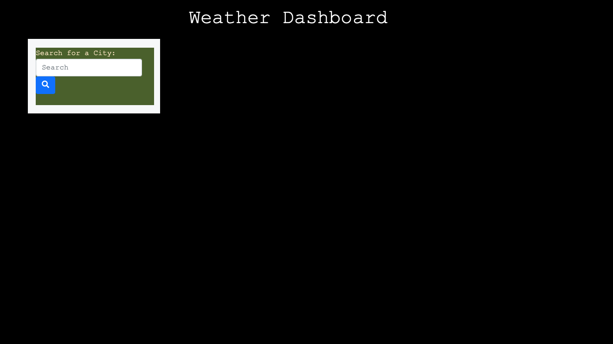
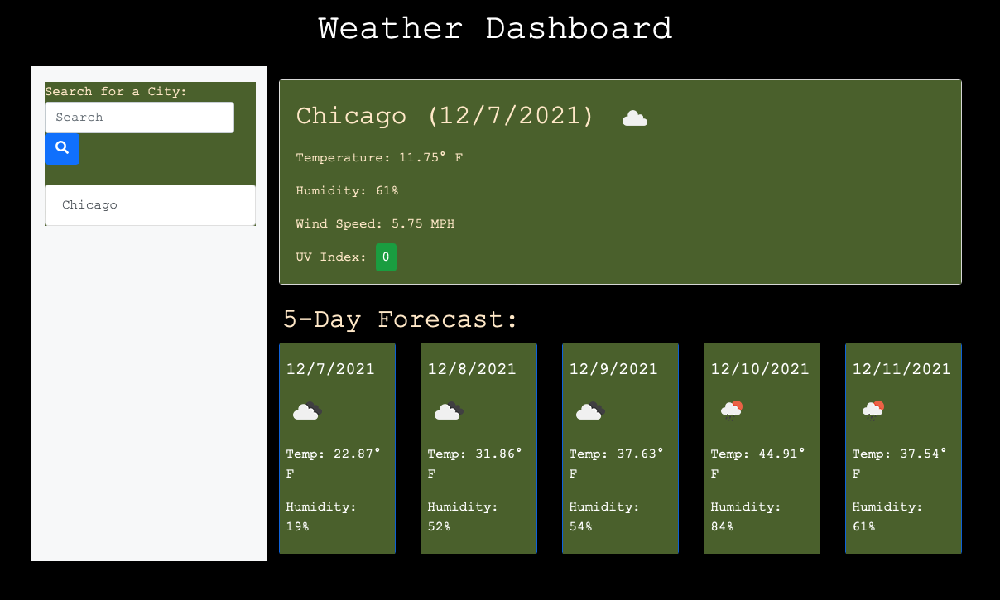
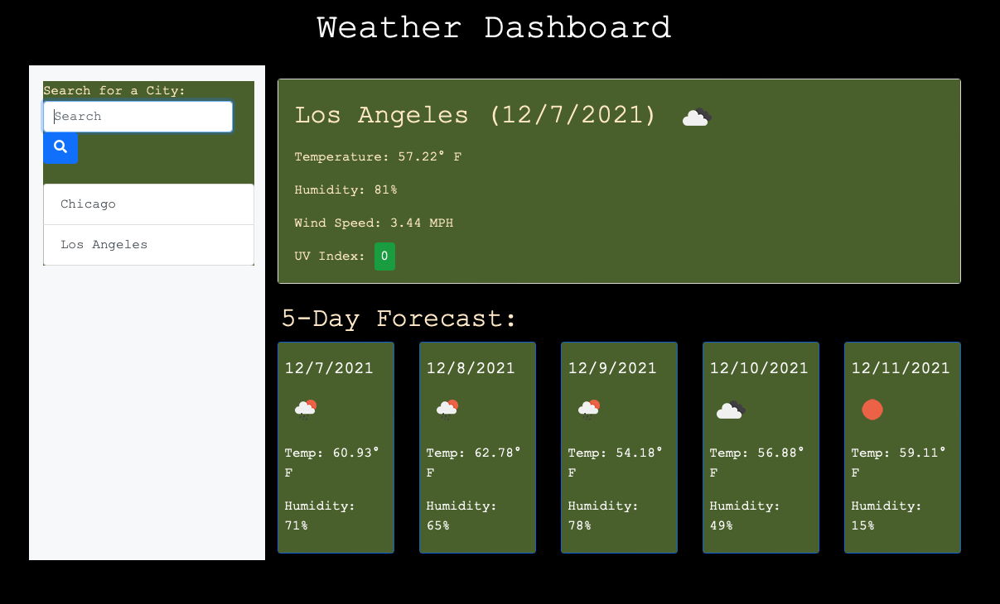

# Weather Forecast Display
Weather Dashboard using API

- Developed a website to retrieve API data from OpenWeatherMap to build a weather dashboard.
- Weather Dashboard gives an overview of current and 5 day future weather conditions.
- Displays searched city name, date, icon that represents weather condition, temperature, humidity, he wind speed and UV index.
- Saves search history and able to reference back to those city conditions.

# Skills Used

- Javascript
- CSS
- HTML
- OpenWeatherMap API

# Images

# Link

https://madavila5.github.io/WeatherForecastDisp/